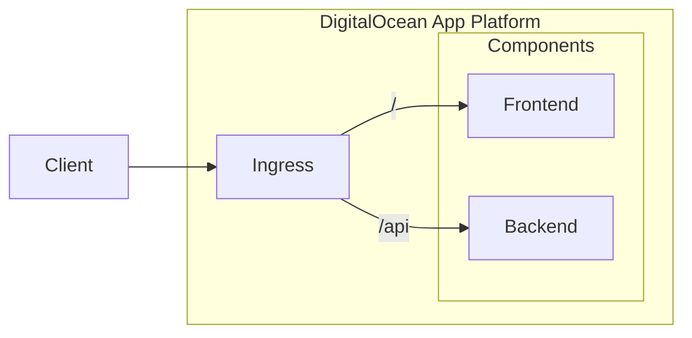
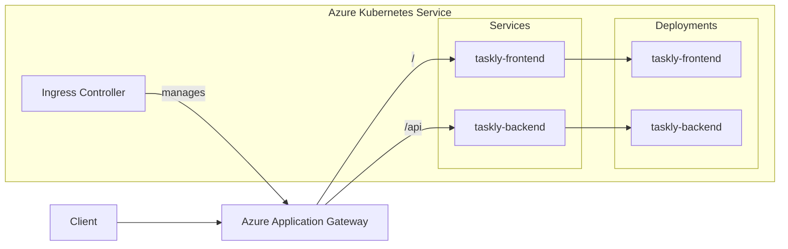
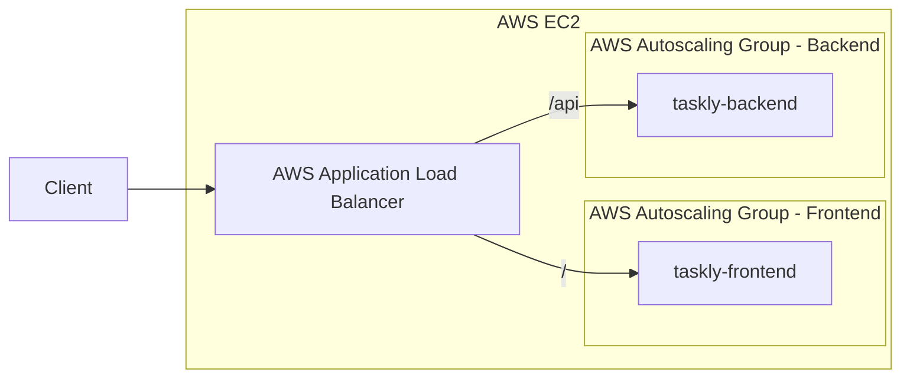

# Taskly

Taskly is an application that allows users to sign in and create tasks. It is
also used by [System Initiative](https://www.systeminit.com/) as an
[assessment](https://github.com/systeminit/assessment-ie3-ecosystem) for their
Infrastructure Engineer III - Ecosystem role.

I have previously submitted the
[assessment](https://github.com/systeminit/assessment-ie3) for the
Infrastructure Engineer III role. To prevent repetitve work, I use the container
images created there for this assessment.

## Implementations

This assessment asked for 3 implementations that deploy Taskly across at least 2
different infrastructure providers.

### Implementation 01: DigitalOcean App Platform

This implementation deploys Taskly on [DigitalOcean App
Platform](https://www.digitalocean.com/products/app-platform). This was the
implementation that I used when I submitted the
[assessment](https://github.com/systeminit/assessment-ie3) for the
Infrastructure Engineer III role. This implementation is in between a serverless
deployment and a managed container service in that the operator does not have to
manage their own infrastructure but it's not as powerful as some of the managed
container services from other infrastructure providers. I chose this
implementation because it was simple to stand up quickly and provided the
ability to configure and scale Taskly if necessary.

The following directories contain the implementation code.

- [`implementation01`](implementation01)

Here's the architecture diagram for this implementation.

### Implementation 02: Azure Kubernetes Service

This implementation deploys Taskly on [Azure Kubernetes
Service](https://azure.microsoft.com/en-us/products/kubernetes-service/). This
implementation deploys an Azure Application Gateway and a Kubernetes cluster
using Azure Kubernetes Service. The Kubernetes cluster is configured to use the
Application Gateway as its ingress. Taskly runs as two deployments (frontend and
backend) that are exposed to the Kubernetes cluster via ClusterIP services.
These services are then exposed to clients via the Application Gateway ingress
using path-based routing to route requests to `/` to the frontend and requests
to `/api` to the backend. I chose this implementation as a way to explore Azure
Kubernetes Service since it's the managed container orchestation service that
I'm the least familiar with.

The following directories contain the implementation code.

- [`implementation02`](implementation02)

Here's the architecture diagram for this implementation.

### Implementation 03: AWS EC2

This implementation deploys Taskly on [AWS EC2](https://aws.amazon.com/ec2/).
This implementation deploys EC2 instances for both the frontend and the backend
services using autocaling groups and launch templates. These EC2 instances spin
up and are configured using user data, where Docker is installed and the
application container is launched. The EC2 instances are then added to their
respective load balancer target groups so that the application load balancer can
use path-based routing to route requests to `/` to the frontend target group and
requests to `/api` to the backend target group. I chose this implementation
because not everyone is ready to move to a managed service (app platform,
container orchestation, etc.). There are a ton of people that are still using
virtual machines for their infrastructure. I also wanted to showcase that I
understood how to use user data. Now due to time constraints I didn't implement
TLS or create immutable EC2 images using something like Packer, but those can be
implemented quickly if desired.

The following directories contain the implementation code.

- [`implementation03`](implementation03)

Here's the architecture diagram for this implementation.

