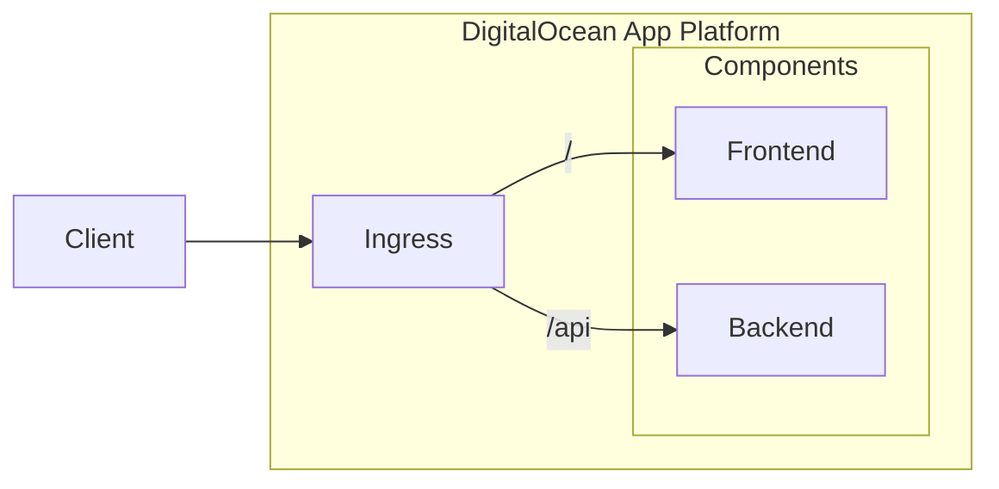

# Taskly

Taskly is an application that allows users to sign in and create tasks. It is
also used by [System Initiative](https://www.systeminit.com/) as an
[assessment](https://github.com/systeminit/assessment-ie3-ecosystem) for their
Infrastructure Engineer III - Ecosystem role.

I have previously submitted the
[assessment](https://github.com/systeminit/assessment-ie3) for the
Infrastructure Engineer III role. To prevent repetitve work, I use the container
images created there for this assessment.

## Implementations

This assessment asked for 3 implementations that deploy Taskly across at least 2
different infrastructure providers.

### Implementation 01: DigitalOcean App Platform

This implementation deploys Taskly on [DigitalOcean App
Platform](https://www.digitalocean.com/products/app-platform). This was the
implementation that I used when I submitted the
[assessment](https://github.com/systeminit/assessment-ie3) for the
Infrastructure Engineer III role. This implementation is in between a serverless
deployment and a managed container service in that the operator does not have to
manage their own infrastructure but it's not as powerful as some of the managed
container services from other infrastructure providers. I chose this
implementation because it was simple to stand up quickly and provided the
ability to configure and scale Taskly if necessary.

The following directories contain the implementation code.

- [`implementation01`](implementation01)

Here's the architecture diagram for this implementation.

